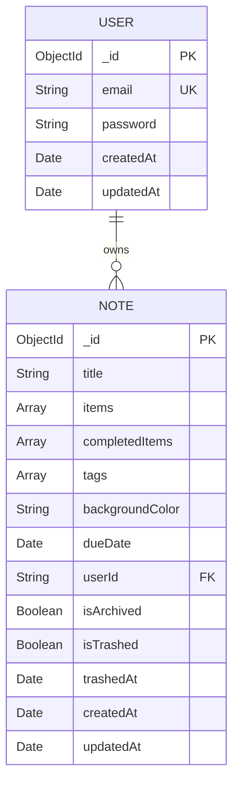
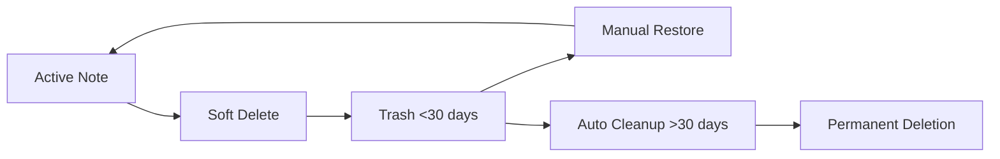

# Note Maker - Task Management Application

A modern, full-stack note-taking and task management application built with NestJS, MongoDB, and vanilla JavaScript. Features user authentication, to-do lists, due dates, automatic cleanup, and a clean Google Keep-inspired interface.

## 🚀 Features

- **User Authentication** - JWT-based authentication with secure login/registration
- **Task Management** - Create notes with to-do items, mark as completed
- **Due Date Reminders** - Set due dates with overdue/upcoming categorization
- **Auto-save** - Real-time saving with visual feedback
- **Search & Filter** - Search notes by title, content, or tags
- **Color Coding** - Customizable note background colors
- **Archive & Trash** - Soft delete with 30-day retention policy
- **Automatic Cleanup** - Cron jobs for permanent deletion of old trashed notes
- **Responsive Design** - Modern UI with professional styling

## 📋 Prerequisites

Before running this project, make sure you have:

- **Node.js** (v16 or higher)
- **npm** (v8 or higher)
- **MongoDB** (v5.0 or higher)

## 🛠️ Installation & Setup

### 1. Clone the Repository
```bash
git clone <repository-url>
cd note-maker
```

### 2. Install Dependencies
```bash
npm install
```

### 3. Environment Configuration
Create a `.env` file in the project root:

```bash
# Database Configuration
MONGODB_URI=mongodb://localhost:27017/notemaker

# JWT Configuration
JWT_SECRET=your-super-secret-jwt-key-change-this-in-production

# Application Configuration
NODE_ENV=development
PORT=3000
```

#### Production Mode
```bash
npm run build
npm run start:prod
```

The application will be available at: `http://localhost:3000`

## 🏗️ Database Architecture

The application uses **MongoDB** as the primary database with two main collections:

### Collections Overview

| Collection | Purpose | Documents |
|------------|---------|-----------|
| `users` | User authentication and profiles | User accounts |
| `notes` | Task lists and note management | User notes/tasks |

### Document Schemas

#### User Collection
```javascript
{
  _id: ObjectId,
  email: String (unique, required),
  password: String (hashed with bcrypt),
  createdAt: Date,
  updatedAt: Date
}
```

#### Note Collection
```javascript
{
  _id: ObjectId,
  title: String (required),
  items: [String],              // Array of to-do items
  completedItems: [Number],     // Array of completed item indices
  tags: [String],               // Max 9 tags
  backgroundColor: String,      // Hex color code
  dueDate: Date,               // Optional due date
  userId: String (required),    // Reference to user
  isArchived: Boolean,
  isTrashed: Boolean,
  trashedAt: Date,             // Timestamp when trashed
  createdAt: Date,
  updatedAt: Date
}
```

## 📊 Entity Relationship Diagram



### Relationship Details

- **One-to-Many**: One User can have many Notes
- **Foreign Key**: `Note.userId` references `User._id`
- **Data Isolation**: Users can only access their own notes
- **Cascading**: No automatic deletion (notes persist for data integrity)

## 🔄 Automated Cleanup System

The application includes an automated cron job system for managing trashed notes:

### Cleanup Schedule

| Job | Schedule | Purpose |
|-----|----------|---------|
| **Daily Cleanup** | Every day at 2:00 AM | Permanently delete notes trashed >30 days ago |
| **Weekly Report** | Sundays at 1:00 AM | Generate trash statistics and health checks |

### Trash Lifecycle



1. **Soft Delete**: Note marked as `isTrashed: true`, `trashedAt: Date`
2. **30-Day Window**: Note visible in trash, can be restored
3. **Auto Cleanup**: Cron job permanently deletes old notes
4. **Manual Cleanup**: API endpoint for immediate cleanup

## 🌐 API Endpoints

### Authentication
```
POST /api/auth/register    - User registration
POST /api/auth/login       - User login
GET  /api/auth/profile     - Get user profile
GET  /api/auth/test-db     - Test database connection
```

### Notes Management
```
GET    /api/notes                 - Get all user notes
POST   /api/notes                 - Create new note
GET    /api/notes/:id             - Get specific note
PUT    /api/notes/:id             - Update note
DELETE /api/notes/:id             - Soft delete note

GET    /api/notes/search?q=query  - Search notes
GET    /api/notes/archived        - Get archived notes
GET    /api/notes/trash           - Get trashed notes
GET    /api/notes/tags            - Get all user tags
GET    /api/notes/tags/:tag       - Get notes by tag
GET    /api/notes/due-dates       - Get overdue/upcoming notes

PUT    /api/notes/:id/restore     - Restore from trash
DELETE /api/notes/:id/permanent   - Permanent delete
GET    /api/notes/trash/stats     - Get trash statistics
POST   /api/notes/trash/cleanup   - Manual cleanup
```

## 🔒 Security Features

- **JWT Authentication** with configurable expiration
- **Password Hashing** using bcrypt with salt rounds
- **Route Protection** via auth guards
- **Data Isolation** - users can only access their own data
- **Input Validation** using class-validator DTOs
- **CORS Configuration** for secure cross-origin requests

## 🎨 Frontend Architecture

- **Vanilla JavaScript** with ES6+ modules
- **CSS Grid/Flexbox** for responsive layouts
- **FontAwesome Icons** for consistent iconography
- **Modal System** for note editing and authentication
- **Auto-save** with debounced API calls
- **Real-time UI Updates** with optimistic updates

## 📁 Project Structure

```
note-maker/
├── src/
│   ├── auth/              # Authentication module
│   │   ├── auth.controller.ts
│   │   ├── auth.service.ts
│   │   ├── auth.module.ts
│   │   ├── jwt.strategy.ts
│   │   ├── jwt-auth.guard.ts
│   │   └── dto/
│   ├── note/              # Notes module
│   │   ├── note.controller.ts
│   │   ├── note.service.ts
│   │   ├── note.module.ts
│   │   └── note.model.ts
│   ├── tasks/             # Scheduled tasks
│   │   └── cleanup.service.ts
│   ├── user/              # User models
│   │   └── user.model.ts
│   ├── utils/             # Utility functions
│   ├── app.module.ts
│   └── main.ts
├── public/                # Frontend assets
│   ├── index.html
│   ├── main.js
│   ├── api.js
│   └── styles/
├── test-*.js             # Test scripts
├── package.json
└── README.md
```


### Cron Job Configuration

Modify `src/tasks/cleanup.service.ts` to adjust cleanup schedules:

```typescript
// Daily cleanup at 2 AM
@Cron(CronExpression.EVERY_DAY_AT_2AM)

// Custom schedule (every 6 hours)
@Cron('0 */6 * * *')
```


**Authentication Issues**
- Verify JWT_SECRET is set in `.env`
- Check browser console for token errors
- Ensure passwords meet minimum requirements (6 characters)

### Debug Mode

Enable debug logging by setting:
```bash
NODE_ENV=development
```

### Support

For additional support or questions:
1. Check the troubleshooting section above
2. Review the test scripts for examples
3. Examine the API endpoints documentation
4. Create an issue in the repository

---

**Happy Note-Taking! 📝✨** 